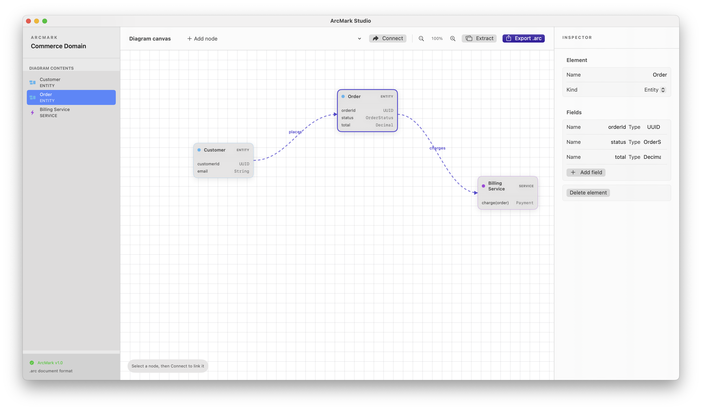

<p align="center">
  
</p>

# ArcMark Studio

ArcMark Studio is a native macOS SwiftUI editor for UML-inspired system diagrams. It models entities, services, events, fields, and directed relationships on a draggable canvas.

## Canvas editor



## Run

```bash
swift run
```

To build a release executable:

```bash
swift build -c release
```

## ArcMark documents

ArcMark diagrams use the `.arc` extension. They contain UTF-8 XML but deliberately do not use the generic `.xml` extension. The schema is available at `Sources/ArcMarkStudio/Resources/arcmark.xsd` and the normative format description is in [SPECIFICATION.md](SPECIFICATION.md).

The app registers the `com.arcmark.diagram` Uniform Type Identifier, declares itself as the Editor for that type, and claims `.arc` files in `ArcMarkStudio-Info.plist`. When packaging the executable as an `.app`, use that Info.plist: macOS Launch Services will then associate `.arc` files with ArcMark Studio and show it in **Open With**.

## Suggestions for the next iteration

- Add `.arc` import/open support so double-clicking a document loads it into the editor.
- Add a relationship-creation gesture and cardinalities (`1`, `0..*`) to get closer to UML class diagrams.
- Add schema validation and helpful node-level errors before saving.
- Persist documents using `FileDocument`, which also enables standard macOS autosave, versions, and recent-documents behavior.
- Add SVG/PDF export for documentation and team sharing.
